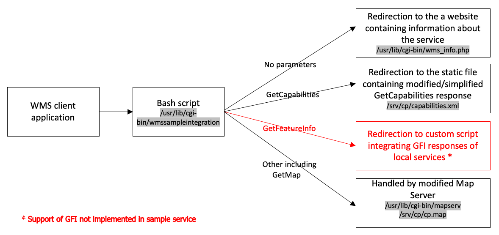

# **Description of a testbed implementation of collective WMS service**

## Introduction
This document describes the process of installation and configuration of modified MapServer supporting integrating WMS services. 
Before reading this document, it is advisable to read the document [Guidance for the integration of dispersed WMS sources](gp-single-access-point.md) first to understand the theoretical background of collective services.
The key MapServer functionality for the WMS server integration is WMS Client. The functionality allows MapServer to transparently fetch remote layers over WMS, basically acting like a client, and combine them with other layers to generate the final map. You can find more about the WMS client configuration in [MapServer documentation](https://mapserver.org/ogc/wms_client.html).

## Changes to MapServer
This modified version of MapServer has been built on version 7.0.7. Following changes/optimisations have been made in the code:
1.	Modified spatial extent of the WMS service. The standard version of MapServer allows defining a spatial extent of WMS service as a bounding box using wms_latlonboundingbox parameter. Modified version allows setting spatial extent of local WMS service using introduced parameter gs_bounds as polygons provided in Well-known text (WKT) format. MapServer will request the local WMS service only when the map view overlaps that polygon, thus reducing network traffic.
2.	Redirection mechanism. If a request covers the spatial extent of only one local service, the collective service does not forward the request to the local service. Still, it returns to the client application proper URI pointing directly to a local service. This is done by utilising properties of Hypertext Transfer Protocol (HTTP). Collective service sends a response URL to the local service with the 302 status code. To achieve this additional parameter gs_sendUrl has been introduced.
3.	Cookies support. Some local servers may require sending additional information stored in cookies. Modified MapServer allows adding cookies to requests. Cookies are stored in a separate file but generated independently from the MapServer app.
4.	Grouping of layers. Request to different layers of the same WMS local service is aggregated. Instead of many requests, one separately for each layer, one request to a WMS local service is sent.

Other minor modifications are focused on improving the efficiency of some MapServer functionalities related to services’ integration, e.g. turning off of not used modules.

Modified MapServer Map files containing services’ configuration cannot be used on the standard version of MapServer. However, standard MapServer configuration files work in the modified version.

## Installation
The installation and configuration described in this document have been tested on Debian 9. Installation and configuration on other operating systems may require changes related to versions of installed libraries and further alteration of MapServer code.
The document assumes that the user with **root privileges** carries the installation process using the terminal. 
The sample implementation of the collective service set up using this document is available at [the endpoint](http://185.238.72.102/cgi-bin/wmssampleintegration?&REQUEST=GetCapabilities&SERVICE=WMS).

### Apache installation
```
apt-get update
apt-get upgrade
apt-get install apache2 apache2-bin apache2-utils libapache2-mod-fcgid
a2enmod cgi fcgid
systemctl restart apache2
```
Check whether the Apache server is working by entering its IP address in the web browser. If everything is ok, the browser should display the Apache default website.

### MapServer installation
Download the file mapserver-7.0.7.zip from GitHub and copy it to location /usr/src/.
```
wget https://raw.githubusercontent.com/marcingrudzien/gp-single-access-point/main/resources/software/mapserver-7.0.7.zip
cp mapserver-7.0.7.zip /usr/src/
```
Unzip the file.
```
cd /usr/src/
apt install unzip
unzip mapserver-7.0.7.zip
```
Install libraries required and recommended to run MapServer. Confirm by pressing "y" key if prompted.
```
apt install gdal-bin libgdal-dev libproj-dev proj-bin libpng-dev freetype2-demos zlib1g-dev libgeos-dev libgif-dev cmake libfcgi-dev libpcre3 libpcre3-dev libcairo2-dev libharfbuzz-dev libfribidi-dev libcurl4-gnutls-dev curl php php-common
```
Copy mapserv file from /usr/src/mapserv-7.0.7/build/ to /usr/lib/cgi-bin/.
```
cp /usr/src/mapserver-7.0.7/build/mapserv /usr/lib/cgi-bin/
```
Make sure the mapserv file has executable permissions.
```
cd /usr/lib/cgi-bin/
chmod 755 mapserv
```
Check whether mapserver works.
```
./mapserv -v
```
If the installation process went ok, following response should be returned in console.
```
MapServer version 7.1-dev //GS OUTPUT=PNG OUTPUT=JPEG SUPPORTS=PROJ SUPPORTS=AGG 
SUPPORTS=FREETYPE SUPPORTS=ICONV SUPPORTS=WMS_SERVER SUPPORTS=WMS_CLIENT 
SUPPORTS=WFS_SERVER SUPPORTS=WCS_SERVER SUPPORTS=THREADS SUPPORTS=GEOS INPUT=JPEG 
INPUT=POSTGIS INPUT=OGR INPUT=GDAL INPUT=SHAPEFILE
```

### Building application (optional)
If you want to compile MapServer code, you may optionally install appropriate libraries.
```
apt install build-essential protobuf-c-compiler protobuf-compiler libprotobuf-c-dev
```
More about compiling MapServer you can find in [the documentation](https://www.mapserver.org/installation/unix.html).
In order to enable key wms client feature, you will need to pass the WITH_CLIENT_WMS option to the configure script e.g.:
```
cmake -DCMAKE_INSTALL_PREFIX=/opt -MAKE_PREFIX_PATH=/usr/local:/opt:/lib:/usr/local/lib:/usr/lib - WITH_CLIENT_WMS=ON ../ >../configure.out.txt
````

## Collective service configuration
This chapter describes step by step how to set up a copy of the sample service in another environment.

Download config files and place them in appropriate locations on your server. Altogether you have to download four configuration files and create one for MapServer logs. Roles and dependencies between configuration files are shown in Figure 1.



_Figure 1 Configuration files dependencies_

[cp.map](resources/software/cp.map) and [capabilities.xml](resources/software/capabilities.xml) files can be placed in a location of your choice, e.g. ```/srv/cp/```. However, if you change the location of the files, you may have to change relevant Apache configuration files. cp.map file contains service configuration including URL of local services. More information about WMS service configuration in MapServer is available in [MapServer documentation](https://mapserver.org/ogc/wms_server.html). capabilities.xml file contains GetCapabilities response of collective WMS service. When a user sends GetCapabilities request the default MapServer response is replaced by the one in capabilities.xml file. It is important to point out that it is not required to replace default GetCapabilities response. However, modified GetCapabilities response is shorter, simplified and more clear and thus more readable for a user.
```
cd /srv
mkdir cp
cd cp
wget https://raw.githubusercontent.com/marcingrudzien/gp-single-access-point/main/resources/software/cp.map
wget https://raw.githubusercontent.com/marcingrudzien/gp-single-access-point/main/resources/software/capabilities.xml
```
Create error.txt file for MapServer logs, and give it the necessary privileges.
```
touch error.txt
chmod 666 error.txt
```

Place [wmssampleintegration](resources/software/wmssampleintegration) and [wms_info.php](resources/software/wms_info.php) files in folder ```/usr/lib/cgi-bin/``` and give them required privileges. File wmssampleintegration redirects incoming user request. There are three redirections in the sample implementation:
-	GetCapabilities request is redirected to srv/cp/capabilities.xml,
-	request without parameters is redirected to wms_info.php file,
-	request with parameters other than GetCapabilities is redirected to MapServer.

wms_info.php file contains website with information about the service. This redirection is optional and doesn’t have to be implemented. However, well designed information website improves the usability of the service.
```
cd  /usr/lib/cgi-bin/
wget https://raw.githubusercontent.com/marcingrudzien/gp-single-access-point/main/resources/software/wmssampleintegration
wget https://raw.githubusercontent.com/marcingrudzien/gp-single-access-point/main/resources/software/wms_info.php
chmod 755 wmssampleintegration
chmod 755 wms_info.php
```
Current service endpoint in configuration files is set to locahost. If needed change it in configuration files to a correct URL of the service. Use the text editor of your choice, e.g. nano.
```
nano /srv/cp/cp.map
```
Edit line with parameter OWS_ONLINERESOURCE and change its value to an appropriate endpoint URL.
Make also similar changes in the capabilities.xml file. Be aware that endpoint has to be alerted in several locations in capabilities.xml file.
```
nano /srv/cp/capabilities.xml
```
Verify whether service works ```http://<server_url>/cgi-bin/wmssampleintegration?REQUEST=GetCapabilities&SERVICE=WMS``` should return the capabilities file. Depending on your specific configuration of your server, please remember to replace ```<server_url>``` with appropriate IP address or domain name.
```
http://<server_url>//cgi-bin/wmssampleintegration?SERVICE=WMS&VERSION=1.3.0&REQUEST=GetMap&BBOX=505895.8969211342046,683893.0375732699176,506340.1024577722419,684271.6885483335936&CRS=EPSG:2180&WIDTH=387&HEIGHT=455&LAYERS=cadastral_parcels,labels&STYLES=,&FORMAT=image/png&DPI=72&MAP_RESOLUTION=72&FORMAT_OPTIONS=dpi:72&TRANSPARENT=TRUE
```
should return the sample map showing cadastral parcels (Figure 2).


_Figure 2 Sample GetMap response_
